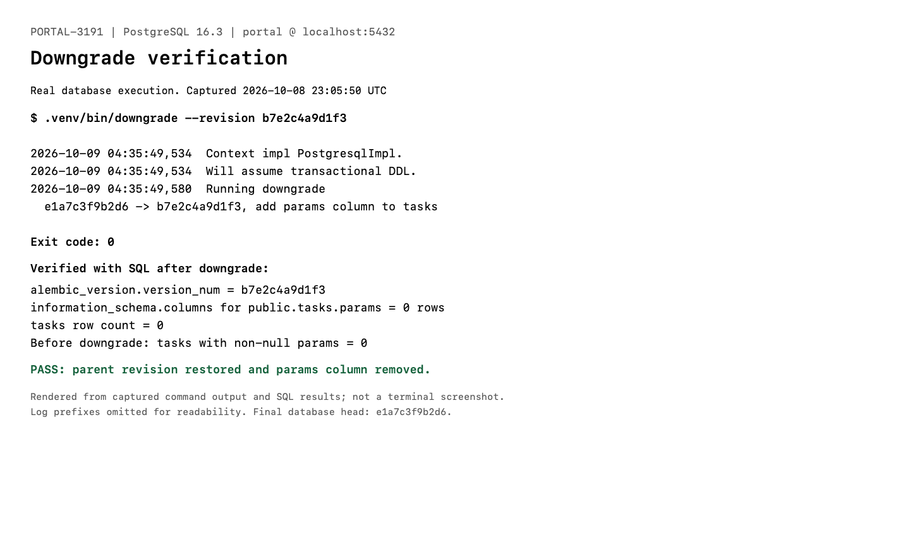
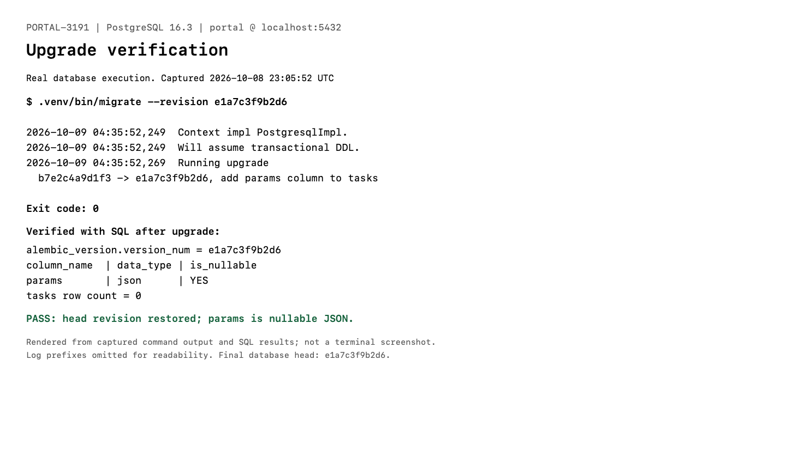

# PORTAL-3191 Migration Evidence

These images render output captured from real Alembic commands and SQL checks against the local `portal` database. They are not terminal screenshots or simulated migration results. Log prefixes and whitespace are simplified for readability. No credentials or application records are included.

- PostgreSQL: `16.3 (Debian 16.3-1.pgdg120+1)`
- Target: `portal` on `localhost:5432`
- Captured: October 9, 2026, 04:35 IST (October 8, 2026, 23:05 UTC)
- Startup `db-migrate` completed successfully through `e1a7c3f9b2d6`.
- Before downgrade, the tasks table contained zero rows and no populated params.
- Only the new params migration was downgraded. The database was immediately upgraded back to the current head.

## Downgrade

```text
$ .venv/bin/downgrade --revision b7e2c4a9d1f3
Running downgrade e1a7c3f9b2d6 -> b7e2c4a9d1f3, add params column to tasks
Exit code: 0

Verified database state:
alembic_version.version_num = b7e2c4a9d1f3
information_schema.columns for public.tasks.params = 0 rows
tasks row count = 0
```



## Upgrade

```text
$ .venv/bin/migrate --revision e1a7c3f9b2d6
Running upgrade b7e2c4a9d1f3 -> e1a7c3f9b2d6, add params column to tasks
Exit code: 0

Verified database state:
alembic_version.version_num = e1a7c3f9b2d6
public.tasks.params = json, nullable YES
tasks row count = 0
```



## Verification Queries

```sql
SELECT version_num FROM alembic_version;

SELECT column_name, data_type, is_nullable
FROM information_schema.columns
WHERE table_schema = 'public'
  AND table_name = 'tasks'
  AND column_name = 'params';

SELECT COUNT(*) FROM tasks;
```

The final database revision is `e1a7c3f9b2d6`, with `tasks.params` restored as nullable JSON.