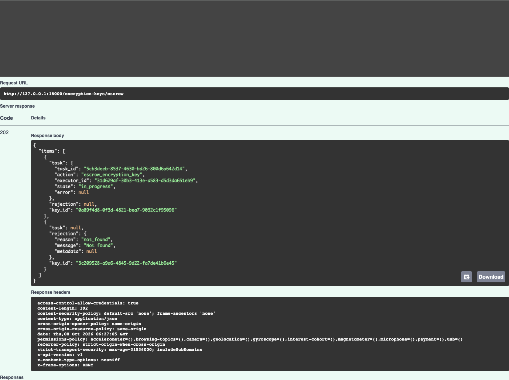
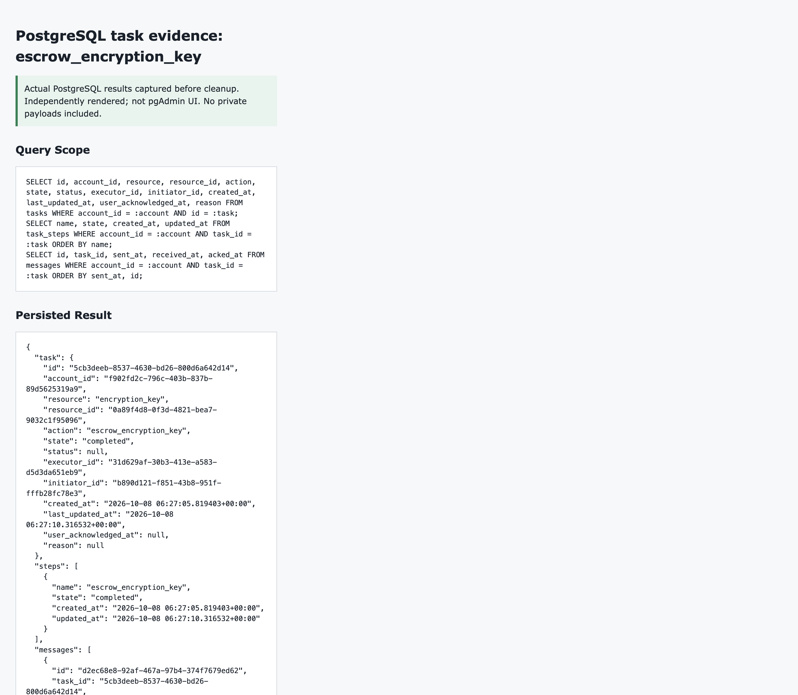
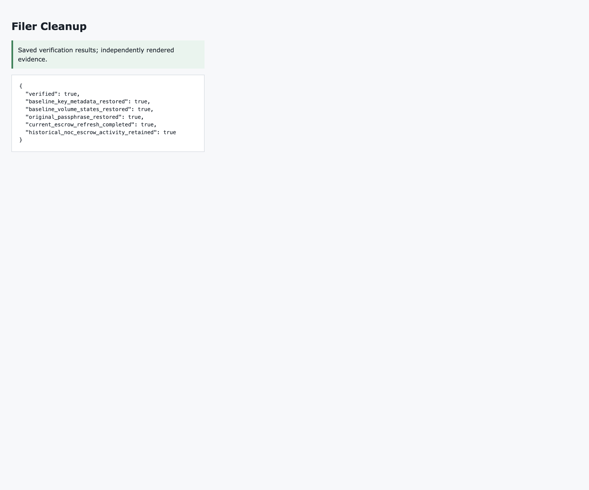

# PORTAL-3299 Testing Evidence

Tested application commit: `3fdd4f6e1c72ab85ab53feaff159e10b9bd44640`.
Related implementation: [nasuni/portal#2838](https://github.com/nasuni/portal/pull/2838).

## Results

| Phase | Verified results |
| --- | --- |
| Initial local Swagger matrix | 284 scenarios passed across nine encryption-key endpoints |
| Initial automated run | 782 tests passed, including 201 PostgreSQL integration tests |
| Real-filer continuation | All six write flows passed; 24 additional Swagger requests, nine completed tasks |
| Mutation audit | Eight expected entries, all attributed to the test actor |
| Screenshots | 1,181 PNGs with SHA-256 checksums; includes historical attempts and diagnostic captures |

The initial local and automated runs are preserved; they were not rerun during the real-filer continuation. HTTP 202 alone was not treated as success: the continuation verified actual NBN completion events, persisted task/step state, and filer state.

## Browse the Evidence

- [Full report and every local Swagger scenario](report.md)
- [Real-filer report and scenario index](real-filer/20261008-100120/report.md)
- [Real-filer request/response records](real-filer/20261008-100120/verified-scenarios.json)
- [Real task, step, and message metadata](real-filer/20261008-100120/all-task-evidence.json)
- [Mutation audit records](real-filer/20261008-100120/activity-audit.json)
- [Automated test commands, counts, and logs](automated/summary.json)
- [Screenshot SHA-256 manifest](png-sha256.json)
- [Publication safety and link checks](publication-verification.json)
- [Publication exclusions and path normalization](publication-manifest.json)

The HTML galleries are also included: [complete gallery](index.html) and [real-filer gallery](real-filer/20261008-100120/index.html). GitHub displays HTML source; use the Markdown reports above for browser navigation on GitHub.

## Representative Screenshots

Real bulk escrow: accepted task and ordered unknown-key rejection

Real task completion and persisted PostgreSQL state

This is a rendering of actual captured PostgreSQL results, not a pgAdmin screenshot.

Filer cleanup verification

## Controls and Limitations

- The approved POC filer runs 10.5. The source minimum was temporarily lowered from 10.6 to 10.5 and restored afterward; this does not demonstrate normal 10.6 eligibility.
- Tests used local account/user/permission fixtures, controlled feature/license cache values, and SSH-observed liveness. Normal IdP, entitlement, and heartbeat ingestion were not tested.
- A temporary API and guarded SQS response worker processed only the test tasks. Filer completion events were real, not injected.
- Public download status/content retrieval is not implemented in this application commit (PORTAL-3190). Download generation and Redis ciphertext metadata were verified; private key material and bundles are not published.
- No production-scale performance testing was performed. Independent NOC volume-record cleanup could not be confirmed because the lookup returned 401; historical escrow records or retained storage versions were not erased.

## Cleanup

The original passphrase and 10.6 minimum were restored. The 58-key/two-volume baseline was preserved, disposable fingerprints were absent from all four private keyrings, and the disposable volume was absent from active/disabled inventory. Local fixtures/caches, the temporary API/worker, two queues, and four subscriptions were removed and verified.

[Final verification](real-filer/20261008-100120/final-verification.json) | [Local cleanup](real-filer/20261008-100120/local-cleanup.json) | [Runtime cleanup](real-filer/20261008-100120/runtime-cleanup-verification.json) | [Private keyring check](real-filer/20261008-100120/private-keyring-cleanup.json)

Authorization controls and passphrase inputs were masked in screenshots. Runtime helper programs, bytecode, and credential metadata are intentionally omitted. Text scanning is not an OCR guarantee; representative screenshots were checked visually. The original local evidence was left unchanged.